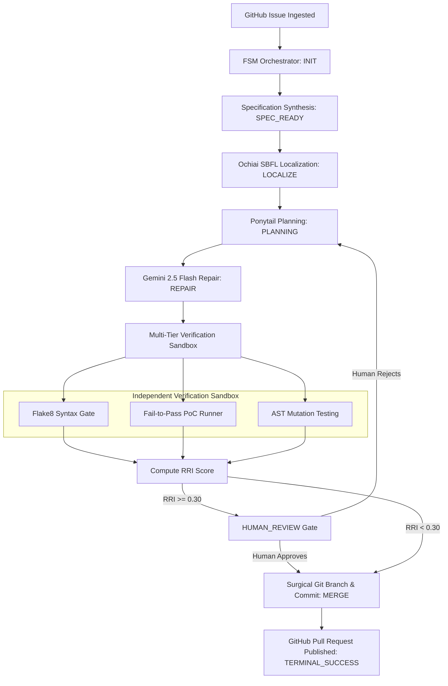

# 🏭 AI Software Factory (ASF)
### Autonomous Verification, Spectrum-Based Fault Localization & Risk-Gated Code Repair

[](https://www.python.org/)
[](https://fastapi.tiangolo.com/)
[](https://ai.google.dev/)
[](https://flake8.pycqa.org/)
[](LICENSE)

An enterprise-grade **Autonomous AI Software Factory** that ingests GitHub issues, mathematically pinpoints defective code using **Spectrum-Based Fault Localization (Ochiai SBFL)**, synthesizes precision patches via **Gemini 2.5 Flash** with **Ponytail YAGNI Invariants**, subjects candidate patches to a **4-Tier Independent Verification Sandbox**, and computes a **Regression Risk Index (RRI)** to either auto-publish a verified GitHub Pull Request or pause for human co-sign review.

---

## 📌 Table of Contents
- [1. The Problem](#1-the-problem)
- [2. The Solution: AI Software Factory](#2-the-solution-ai-software-factory)
- [3. How It Works: The 9-Stage FSM Pipeline](#3-how-it-works-the-9-stage-fsm-pipeline)
- [4. Core Architectural Components](#4-core-architectural-components)
  - [Spectrum-Based Fault Localization (Ochiai SBFL)](#a-spectrum-based-fault-localization-ochiai-sbfl)
  - [Ponytail "Lazy Senior Developer" Invariants](#b-ponytail-lazy-senior-developer-invariants)
  - [4-Tier Independent Verification Sandbox](#c-4-tier-independent-verification-sandbox)
  - [Regression Risk Index (RRI) & Human Review Gate](#d-regression-risk-index-rri--human-review-gate)
  - [Surgical Single-File Git PR Publisher](#e-surgical-single-file-git-pr-publisher)
- [5. System Architecture & Workflow](#5-system-architecture--workflow)
- [6. Technology Stack](#6-technology-stack)
- [7. Project Directory Structure](#7-project-directory-structure)
- [8. Installation & Quickstart Guide](#8-installation--quickstart-guide)
- [9. Running the Interactive Developer Dashboard](#9-running-the-interactive-developer-dashboard)
- [10. Testing & Verification](#10-testing--verification)

---

## 1. The Problem

Standard AI coding assistants (e.g., naive LLM chatbots, copilot extensions) fail when deployed directly to production codebases for autonomous issue resolution:

1. **Blind File Guessing**: Chatbots lack automated localization across large multi-file repositories, often hallucinating changes in unrelated modules.
2. **Over-Engineering & Code Bloat**: Naive LLMs tend to rewrite entire classes or introduce unnecessary abstractions rather than applying minimal, targeted fixes.
3. **Broken Public Interfaces**: LLMs frequently alter public function signatures, breaking downstream consumers.
4. **Lack of Independent Verification**: AI cannot prove its own fixes work. Unchecked patches frequently introduce syntax errors, regression test failures, and subtle logic bugs.
5. **Direct Unchecked Merging**: Deploying AI-generated code without quantitative risk metrics creates high vulnerability and downtime risks.

---

## 2. The Solution: AI Software Factory

**AI Software Factory** replaces unverified code generation with a **Deterministic Finite State Machine (FSM)** governed by strict verification contracts:

```
Issue Ingestion ──▶ Spectrum Fault Localization ──▶ Ponytail YAGNI Repair ──▶ 4-Tier Verification ──▶ RRI Risk Gate ──▶ GitHub PR
```

- **Mathematical Localization**: Uses the Ochiai SBFL metric to rank suspicious functions before prompting the LLM.
- **Minimalist Repair Engine**: Enforces "Ponytail Rules" (YAGNI, standard library preference, minimal lines changed).
- **Zero-Trust Verification**: Candidate code is placed in an isolated sandbox and tested against:
  - Flake8 Syntax & Critical Error Gate (`E999`, `F821`, `F822`, `F831`).
  - Automated Fail-to-Pass PoC Verification.
  - AST Mutation Testing (asserting 100% mutant kill rate).
- **Mathematical Risk Gating**: Computes the **Regression Risk Index (RRI)**. Patches with $\text{RRI} < 0.30$ are automatically staged into a dedicated branch and published as Pull Requests; high-risk patches halt for human review.

---

## 3. How It Works: The 9-Stage FSM Pipeline

The factory orchestrates every issue through an immutable 9-stage state machine:

| Stage | State Name | Description |
| :---: | :--- | :--- |
| **01** | `INIT` | Ingests issue JSON payload, validates workspace path, and creates database ledger entry. |
| **02** | `SPEC_READY` | Synthesizes a formal contract (preconditions, postconditions, complexity bounds). |
| **03** | `LOCALIZATION` | Runs Ochiai SBFL & AST Symbol Mapper to pinpoint top suspicious functions. |
| **04** | `PLANNING` | Generates a minimal repair strategy enforcing Ponytail YAGNI constraints. |
| **05** | `REPAIR` | Synthesizes a surgical search-and-replace unified diff using Gemini 2.5 Flash. |
| **06** | `VERIFICATION` | Runs independent Flake8 linter, regression tests, Fail-to-Pass PoC & AST Mutation analysis. |
| **07** | `HUMAN_REVIEW` | Computes Regression Risk Index (RRI). If $\text{RRI} \ge 0.30$, holds for human co-sign. |
| **08** | `MERGE` | Surgically stages only the modified target file, commits with audit report, pushes branch. |
| **09** | `TERMINAL_SUCCESS` | Pull Request is published and linked on GitHub with full telemetry audit trail. |

---

## 4. Core Architectural Components

### A. Spectrum-Based Fault Localization (Ochiai SBFL)
The fault localization engine uses the industry-standard **Ochiai Metric** to calculate function-level suspiciousness:

$$\text{Suspiciousness}(m) = \frac{\text{failed}(m)}{\sqrt{\text{total\_failed} \times (\text{failed}(m) + \text{passed}(m))}}$$

The engine parses the repository into Python AST symbol tables (`intelligence/symbol_map.py`), executes test coverage runs (`intelligence/sbfl_engine.py`), and ranks the most suspicious code targets.

---

### B. Ponytail "Lazy Senior Developer" Invariants
To prevent AI hallucination and over-engineering, prompt instructions in `agents/llm_client.py` and `fsm/orchestrator.py` enforce strict rules:
1. **Search-and-Replace Blocks**: Never rewrite entire files; produce surgical `<<<<<<< SEARCH` / `=======` / `>>>>>>> REPLACE` chunks.
2. **YAGNI (You Aren't Gonna Need It)**: Fix only the defect reported in the issue. No refactoring, no speculative helpers.
3. **Interface Preservation**: Public method signatures, arguments, and return types must not be broken.
4. **Standard Library Priority**: Never add new third-party dependencies unless explicitly instructed.

---

### C. 4-Tier Independent Verification Sandbox
Before any code is committed, it passes 4 independent gates in `verification/runner.py`:
1. **Flake8 Syntax Gate**: Audits syntax errors (`E999`), undefined names (`F821`), and undefined variables (`F822`).
2. **Fail-to-Pass PoC**: Verifies that the PoC test reproduced the failure on original code and passes on patched code.
3. **Regression Test Runner**: Executes existing test suites to prevent regression breaks.
4. **AST Mutation Testing (`verification/mutation_tester.py`)**: Introduces mutation operators (e.g. `in` $\to$ `not in`, `<` $\to$ `<=`). If the test suite fails to detect the mutant, the patch is rejected.

---

### D. Regression Risk Index (RRI) & Human Review Gate
The Risk Engine in `risk/rri_engine.py` evaluates the candidate patch against a mathematical risk model:

$$\text{RRI} = (w_1 \times \text{Lines\_Changed\_Normalized}) + (w_2 \times \text{AST\_Interface\_Breaks}) + (w_3 \times \text{Mutation\_Survival\_Ratio})$$

- **Threshold $< 0.30$**: **LOW RISK** $\implies$ Autonomous branch push and PR creation.
- **Threshold $\ge 0.30$**: **HIGH RISK** $\implies$ Halts in `HUMAN_REVIEW` state until approved via the UI co-sign action.

---

### E. Surgical Single-File Git PR Publisher
The Git publisher in `git_ops/publisher.py`:
- Parses the unified diff header (e.g. `--- a/django/forms/models.py`).
- Creates an isolated branch (e.g. `asf/fix-feat-404`).
- Surgically stages **only the target source file** (preventing accidental staging of local files or virtual environments).
- Pushes the branch to GitHub with a signed commit message and verification summary.

---

## 5. System Architecture & Workflow



---

## 6. Technology Stack

| Layer | Technology | Purpose |
| :--- | :--- | :--- |
| **Backend API** | FastAPI / Uvicorn | High-performance async REST API and static server |
| **LLM Engine** | Google Gemini 2.5 Flash (`google-genai` SDK) | Live fault localization, patch synthesis, and PoC generation |
| **Fault Localization** | Ochiai Metric & AST Symbol Maps | Mathematical spectrum-based bug localization |
| **Verification & Linting** | Flake8, AST Mutation Engine, Pytest | Multi-tier independent verification sandbox |
| **Database & Ledger** | SQLite3 / Raw SQL Schema | Immutable audit trail of state transitions and attempts |
| **Git Automation** | Git CLI & GitHub REST API | Surgical staging, branch management, and PR publishing |
| **Frontend UI** | HTML5, Vanilla CSS3, JavaScript | Clean developer dashboard (GitHub/Linear dark aesthetic) |

---

## 7. Project Directory Structure

```text
Ai-software-factory/
├── main.py                      # FastAPI application entrypoint & static mounting
├── database.py                  # SQLite database engine and schema manager
├── schema.sql                   # Database table definitions for ledger and issues
├── requirements.txt             # Python dependencies
├── .env                         # Environment variables (GEMINI_API_KEY)
│
├── fsm/                         # Deterministic Finite State Machine
│   ├── __init__.py
│   ├── states.py                # FSM state enumerations & transitions
│   └── orchestrator.py          # State machine loop and lifecycle controller
│
├── intelligence/                # Codebase Intelligence & Fault Localization
│   ├── __init__.py
│   ├── symbol_map.py            # AST symbol parsing & function mapping
│   └── sbfl_engine.py           # Ochiai Spectrum-Based Fault Localization
│
├── agents/                      # LLM Agent Interfaces
│   ├── __init__.py
│   └── llm_client.py            # Gemini 2.5 Flash live client & prompt contracts
│
├── verification/                # Multi-Tier Independent Verification
│   ├── __init__.py
│   ├── runner.py                # Flake8 syntax and regression test runner
│   └── mutation_tester.py       # AST mutation testing & kill rate scoring
│
├── risk/                        # Regression Risk Assessment
│   ├── __init__.py
│   └── rri_engine.py            # RRI mathematical calculation engine
│
├── git_ops/                     # Version Control Operations
│   ├── __init__.py
│   └── publisher.py             # Surgical file staging, branching & PR creation
│
├── static/                      # Interactive Web Dashboard
│   ├── index.html               # Main dashboard UI structure
│   ├── style.css                # Clean developer CSS (GitHub/Linear theme)
│   └── app.js                   # UI polling, dynamic charts, diff rendering
│
└── tests/                       # Automated Test Suite
    ├── test_fsm_orchestrator.py # FSM transition and execution tests
    ├── test_sbfl.py             # Ochiai localization tests
    ├── test_mutation.py         # AST mutation analyzer tests
    └── test_rri_and_review.py   # Risk model and human gate tests
```

---

## 8. Installation & Quickstart Guide

### Prerequisites
- **Python 3.10+** installed on your system.
- **Git** installed and configured.
- A **Gemini API Key** from [Google AI Studio](https://aistudio.google.com/).

### Step 1: Clone the Repository
```bash
git clone https://github.com/Princeg0210/Ai-software-factory.git
cd Ai-software-factory
```

### Step 2: Set Up a Virtual Environment & Install Dependencies
```bash
python3 -m venv venv
source venv/bin/activate   # On Windows: venv\Scripts\activate
pip install -r requirements.txt
```

### Step 3: Configure Environment Variables
Create a `.env` file in the project root:
```ini
GEMINI_API_KEY="YOUR_GEMINI_API_KEY_HERE"
```

---

## 9. Running the Interactive Developer Dashboard

Start the FastAPI server on port 8000:
```bash
python3 -m uvicorn main:app --host 0.0.0.0 --port 8000 --reload
```

Open your browser at:
👉 **[http://localhost:8000/](http://localhost:8000/)**

### Running an Issue Repair from the Dashboard:
1. Click **"Auto-Fill My Repo"** or **"Django-13933"** to load a test scenario.
2. Ensure **"Mutation Testing"** and **"Autonomous Auto-Merge"** toggles are enabled.
3. Click **"Dispatch FSM Repair"**.
4. Watch the live telemetry:
   - **FSM Stepper**: Transitions through all 9 states with live pulse animations.
   - **Telemetry Cards**: Computes live RRI score, Flake8 syntax checks, and Mutation Kill Rate.
   - **Unified Diff**: Displays syntax-highlighted code repairs.
   - **Ochiai SBFL Table**: Ranks suspicious functions.
   - **PR Ready**: Click **"View Pull Request on GitHub"** to inspect the live PR.

---

## 10. Testing & Verification

Run the comprehensive unit and integration test suite:

```bash
# Run all automated tests
pytest -v

# Run FSM state machine tests
pytest tests/test_fsm_orchestrator.py -v

# Run Ochiai SBFL localization tests
pytest tests/test_sbfl.py -v

# Run Regression Risk Index (RRI) & Human Review Gate tests
pytest tests/test_rri_and_review.py -v

# Run AST Mutation Testing tests
pytest tests/test_mutation.py -v


## The Substitute option after installing requirements.py

#(Run with Virtual Environment (Recommended)
1- source .venv/bin/activate
uvicorn main:app --host 0.0.0.0 --port 8000 --reload


#Run Directly (One-Liner without activating)
2-.venv/bin/uvicorn main:app --host 0.0.0.0 --port 8000 --reload


#Run with Anaconda Python
3-/opt/anaconda3/bin/python3 -m uvicorn main:app --host 0.0.0.0 --port 8000 --reload


```

---

## 📄 License
Distributed under the **MIT License**. See `LICENSE` for details.
