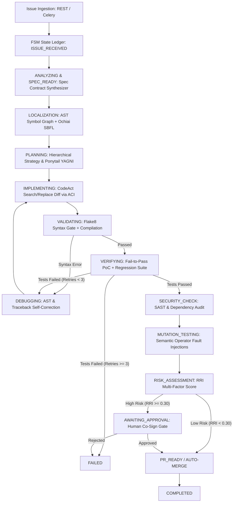

# System Architecture: AI Software Factory (ASF)

## 1. Overview
The AI Software Factory is an event-driven, verification-first automated software repair system that replaces stochastic agentic loops with a deterministic Finite State Machine (FSM).

## 2. Decoupled Subsystem Layers
1. **API & Orchestration Layer (`main.py`, `fsm/`)**: Drives the deterministic state engine and persists immutable transition records into PostgreSQL/SQLite.
2. **Repository Intelligence Layer (`intelligence/`)**: AST symbol graph mapping, call-relationship indexing, and Ochiai spectrum-based fault localization.
3. **Agent & ACI Layer (`agents/`)**: Task-scoped agents (Localization, CodeAct Repair, Verification) operating inside a 100-line chunk viewing window under Ponytail rules.
4. **Deterministic Validation & Sandbox Layer (`sandbox/`, `verification/`, `security/`)**: Flake8 linter gate, ephemeral Docker sandbox isolation (`--network none`, non-root user), AST mutation testing engine, and SAST scanner.
5. **Risk-Adaptive Human Approval Layer (`risk/`)**: Calculates Regression Risk Index (RRI) and routes high-risk diffs to interactive Slack/Teams review gateways.
